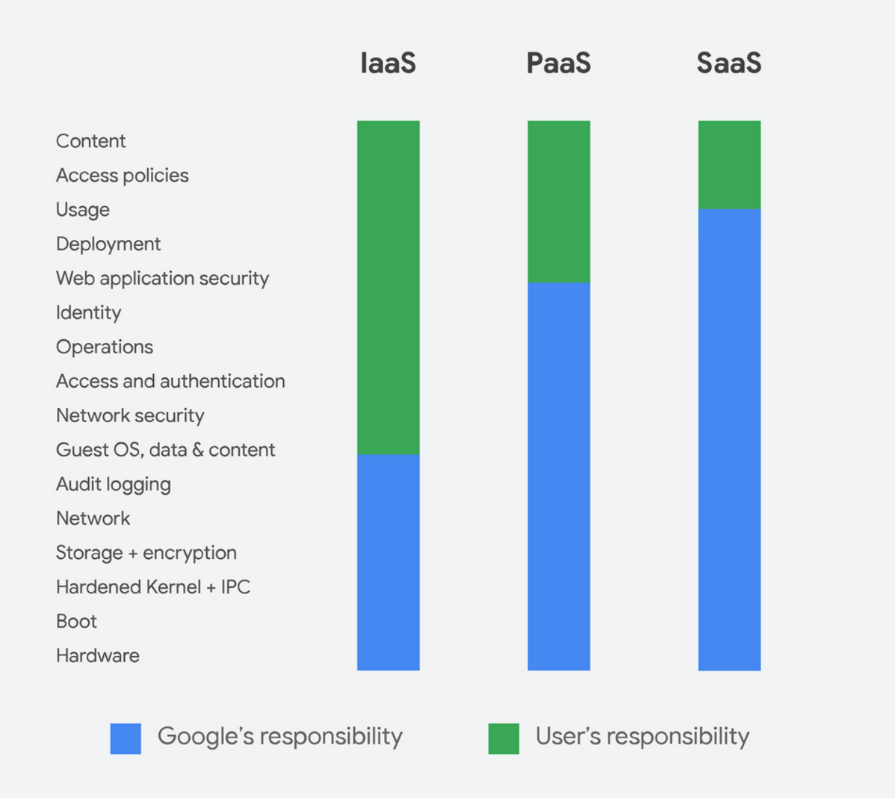

[Next](https://github.com/paulowe/gcp/blob/main/gcp-core-infrastructure/vpc-networks.md)

This is a summary of all my notes for the Google Cloud Platform professional architect track

## 1. GCP Core Infrastructure                                                                                                                                           
### Fundamentals
Global infrastructure

[VPC and Networking concepts](https://github.com/paulowe/gcp/blob/main/gcp-core-infrastructure/vpc-networks.md)

[Cloud Load Balancing](https://github.com/paulowe/gcp/blob/main/gcp-core-infrastructure/cloud-load-balancer.md)

Shared Responsibility Model

[Pricing innovations](https://github.com/paulowe/gcp/blob/main/gcp-core-infrastructure/pricing.md)

[Interconnect Options](https://github.com/paulowe/gcp/blob/main/gcp-core-infrastructure/interconnect-options.md)
### Storage
[Comparing storage options](https://github.com/paulowe/gcp/blob/main/gcp-core-infrastructure/comparing-storage-options.md) 

[Cloud Storage](https://github.com/paulowe/gcp/blob/main/gcp-core-infrastructure/storage.md)

[Cloud SQL](https://github.com/paulowe/gcp/blob/main/gcp-core-infrastructure/cloud-sql.md)

[Cloud Datastore](https://github.com/paulowe/gcp/blob/main/gcp-core-infrastructure/cloud-datastore.md)
### Compute

#### VMs (IaaS)
[Compute Engine](https://github.com/paulowe/gcp/blob/main/gcp-core-infrastructure/compute-engine.md)
#### Containers (Hybrid)
[Kubernetes Engine](https://github.com/paulowe/gcp/blob/main/gcp-core-infrastructure/kubernetes-engine.md)

[Anthos](https://github.com/paulowe/gcp/blob/main/gcp-core-infrastructure/anthos.md)  
#### Application Framework (PaaS)
[App Engine](https://github.com/paulowe/gcp/blob/main/gcp-core-infrastructure/app-engine.md)

[Apigee & Cloud Endpoints](https://github.com/paulowe/gcp/blob/main/gcp-core-infrastructure/apigee_cloud-endpoints.md)

#### Function as a Service

Cloud Functions

### Deploying and Monitoring in the Cloud
[Deployment Manager](https://github.com/paulowe/gcp/blob/main/gcp-core-infrastructure/deployment-manager.md)

Stackdriver

### Big Data and ML
[Big Data and ML in GCP](https://github.com/paulowe/gcp/blob/main/gcp-core-infrastructure/big_data_ml.md)

[Cloud Dataproc](https://github.com/paulowe/gcp/blob/main/gcp-core-infrastructure/dataproc.md)

[Cloud Dataflow](https://github.com/paulowe/gcp/blob/main/gcp-core-infrastructure/dataflow.md)

[Cloud Pub/Sub](https://github.com/paulowe/gcp/blob/main/gcp-core-infrastructure/cloud-pubsub.md)

[Big Query](https://github.com/paulowe/gcp/blob/main/gcp-core-infrastructure/bigquery.md)

### CLI tools on GCP 
[gcloud](https://github.com/paulowe/gcp/blob/main/gcp-core-infrastructure/gcloud.md)

[gsutil](https://github.com/paulowe/gcp/blob/main/gcp-core-infrastructure/gsutil.md)

### Personal research
[Snapshots](https://github.com/paulowe/gcp/blob/main/gcp-core-infrastructure/snapshots.md)

## 2. Essential Cloud Infrastructure
### Introduction
[Interacting with GCP](https://github.com/paulowe/gcp/blob/main/interacting-with-gcp.md)

[Cloud Shell](https://github.com/paulowe/gcp/blob/main/cloud-shell.md)

[Automation on GCP](https://github.com/paulowe/gcp/blob/main/automation-on-gcp.md)

### Virtual Networks
[VPC Objects](https://github.com/paulowe/gcp/blob/main/vpc-objects.md)

[IP Addresses](https://github.com/paulowe/gcp/blob/main/ip-addresses.md)

[Cloud NAT and Private Google Access](https://github.com/paulowe/gcp/blob/main/cloud-nat-pga.md)

### Virtual Machines

[Virtual Machines Overview](https://github.com/paulowe/gcp/blob/main/virtual-machines-overview.md)

[Virtual Machines](https://github.com/paulowe/gcp/blob/main/virtual-machines.md)

[Virtual Machines Access and Lifecycle](https://github.com/paulowe/gcp/blob/main/vm-access-lifecycle.md)

[Compute Options (vCPU and Memory)](https://github.com/paulowe/gcp/blob/main/compute-options.md)

[Images](https://github.com/paulowe/gcp/blob/main/images.md)

[Disk Options](https://github.com/paulowe/gcp/blob/main/disk-options.md)

[Compute Pricing and Special Configurations](https://github.com/paulowe/gcp/blob/main/vm-pricing-special-configs.md)

[Common Compute Engine Actions](https://github.com/paulowe/gcp/blob/main/compute-engine-actions.md)

[Advanced Compute Engine Config and Server management](https://github.com/paulowe/gcp/blob/main/mc-server-lab.md)

### Cloud IAM

### Storage and Database Services
[Overview](https://github.com/paulowe/gcp/blob/main/storage-db-overview.md)

[Cloud Storage](https://github.com/paulowe/gcp/blob/main/cloud-storage.md)

[Cloud Filestore](https://github.com/paulowe/gcp/blob/main/cloud-filestore.md)

[Cloud Storage Features](https://github.com/paulowe/gcp/blob/main/cloud-storage-features.md)

[Cloud Storage Access](https://github.com/paulowe/gcp/blob/main/cloud-storage-access.md)

[Common Cloud Storage Operations](https://github.com/paulowe/gcp/blob/main/common-cloud-storage-ops.md)

[Cloud SQL](https://github.com/paulowe/gcp/blob/main/cloud-sql.md)

[Cloud SQL Tips](https://github.com/paulowe/gcp/blob/main/cloud-sql-tips.md)

[Cloud Spanner](https://github.com/paulowe/gcp/blob/main/cloud-spanner.md)

[Cloud Firestore](https://github.com/paulowe/gcp/blob/main/cloud-firestore.md)

[Cloud Bigtable](https://github.com/paulowe/gcp/blob/main/cloud-bigtable.md)

[Cloud Memorystore](https://github.com/paulowe/gcp/blob/main/cloud-memstore.md)

### Resource Management
[Resource Management overview](https://github.com/paulowe/gcp/blob/main/resource-mgt-overview.md)

[Resource Manager](https://github.com/paulowe/gcp/blob/main/resource-manager.md)

[Analyzing Billing Data with BigQuery](https://github.com/paulowe/gcp/blob/main/analyzing-billing-data.md)

### Resource Monitoring
[Overview](https://github.com/paulowe/gcp/blob/main/resource-monitoring.md)

[Stackdriver Monitoring](https://github.com/paulowe/gcp/blob/main/stackdriver-monitoring.md)

[Stackdriver Logging](https://github.com/paulowe/gcp/blob/main/stackdriver-logging.md)

[Stackdriver Error Reporting](https://github.com/paulowe/gcp/blob/main/stackdriver-error-reporting.md)

[Stackdriver Trace](https://github.com/paulowe/gcp/blob/main/stackdriver-trace.md)

[Stackdriver Debugger](https://github.com/paulowe/gcp/blob/main/stackdriver-debugger.md)

## 3. Cloud Infrastructure: Scaling and Automation
### Interconnecting Networks

### Load Balancing and Autoscaling

### Infrastructure Automation

### Managed Services

## 4. Reliable Cloud Infrastructure: Design and Process
### Defining Services

### Microservice Design and Architecture

### DevOps Automation

### Choosing Storage Solutions

### Google Cloud and Hybrid Network Architectures

### Deploying Applications to GCP

### Designing Reliable Systems

### Security

### Maintenance and Monitoring
